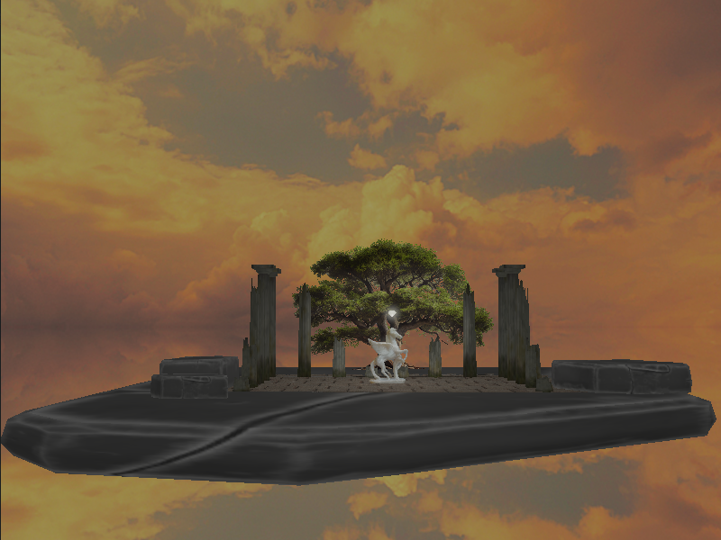
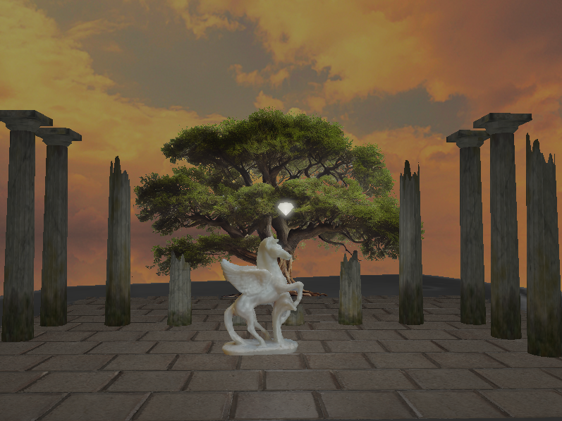

|  |  |
| --- | --- |

# project_base
Prazan projekat sa pratećim bibliotekama koje koristimo na času `https://github.com/matf-racunarska-grafika/project_base.git`

# Uputstvo
1. Main se nalazi u src/main.cpp
2. Cpp fajlovi idu u src folder
3. Zaglavlja (h i hpp) fajlovi idu u include
4. Šejderi idu u folder shaders. `Vertex shader` ima ekstenziju `.vs`, `fragment shader` ima ekstenziju `.fs`

---------------------------
## **Komande**

| ***Key*** | ***Action*** |
| ----------- | ----------- |
| ***Camera*** |
| W | Forward |
| S | Back |
| A | Left |
| D | Right |
| ***Imgui*** |
| F1 |  On/Off |
|  ***Anti-aliasing***  |
| I | On |
| O | Off |
| ***Light*** |
| P | On/Off |
| **Esc** | **Exit** |

# Projekat sadrži
-   **Blending (discard)**: drvo
-   **Face culling**: primenjuje se za sve modele osim stubova
-   **Advaced lighting**: osvetljenje se računa po Blinn-Phongovom modelu
-   **Cubemaps (grupa A)**: skybox
-   **Normal i Parallax mapping (grupa B)**: ploče na podlozi

## Detalji o kursu

Školska 2022/2023. godina  
Asistent: Marko Spasić  
Profesor: dr  Vesna Marinković
